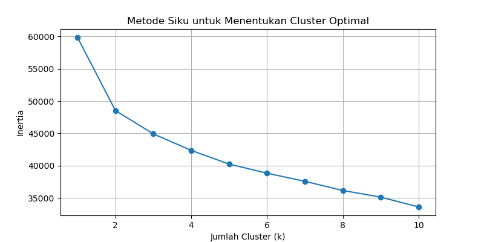
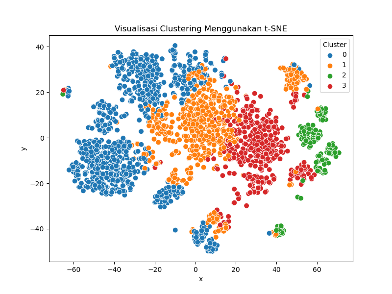
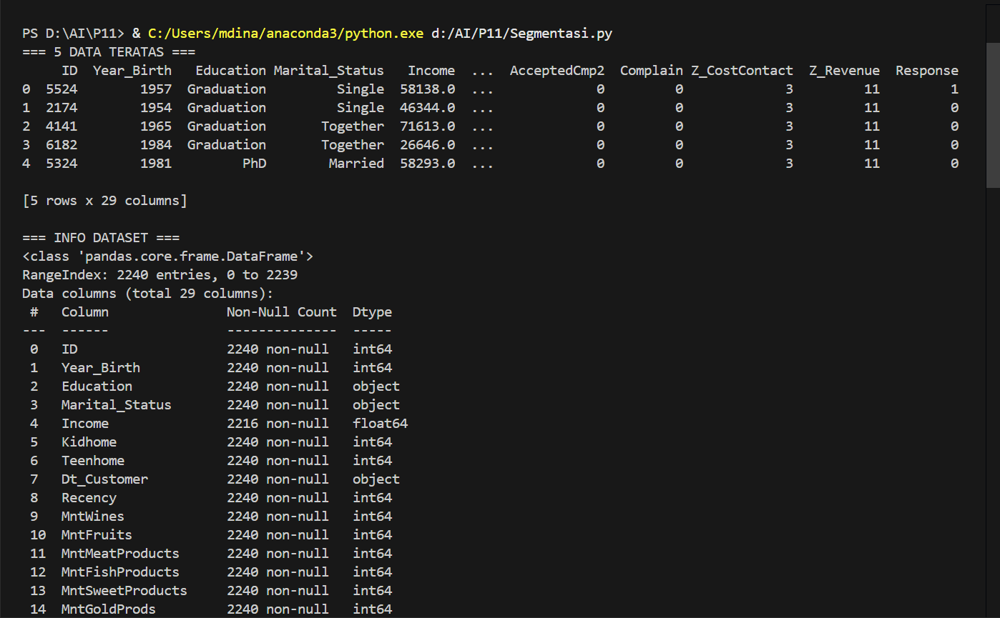
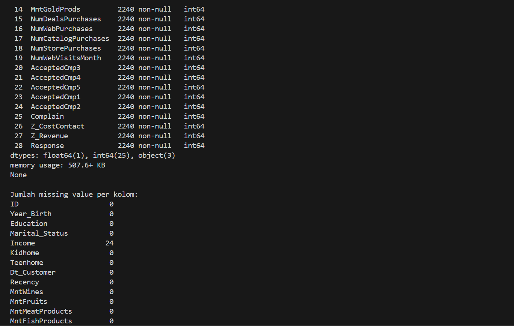
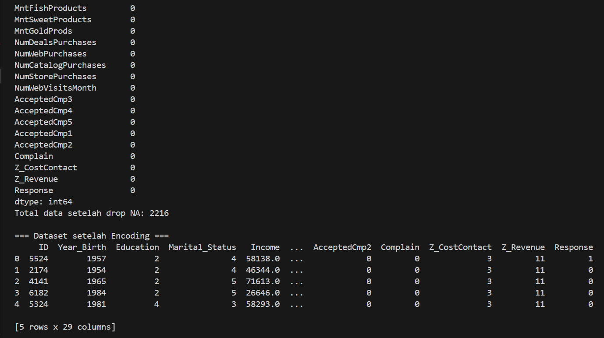
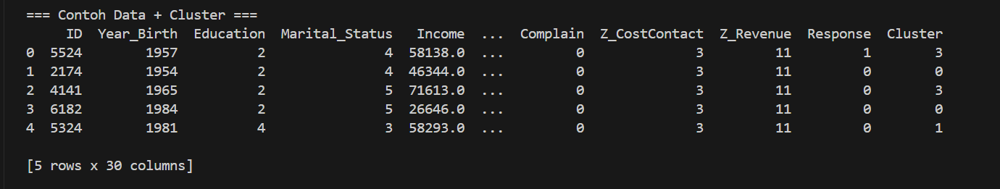

|       |                                   |
| ----- | --------------------------------- |
| Nama  | Zalfa Dewi Zahrani (312210320) |
| Kelas | TI.22.A.SE.1                      |
| Tugas | Kecerdasan Buatan                 |

# Coding Lengkap Segmentasi Pelanggan

```py
# ============================
# 1. IMPORT LIBRARIES
# ============================
import numpy as np
import pandas as pd
import matplotlib.pyplot as plt
import seaborn as sns

from sklearn.preprocessing import StandardScaler, LabelEncoder
from sklearn.cluster import KMeans
from sklearn.manifold import TSNE

import warnings
warnings.filterwarnings('ignore')


# ============================
# 2. LOAD DATASET
# ============================
df = pd.read_csv('segmentasi.csv')
print("Preview Dataset:")
print(df.head())
print("\nInfo Dataset:")
print(df.info())
@mdinalayubi


# ============================
# 3. PRA-PROSES DATA
# ============================

# Mengecek nilai kosong
print("\nCek Nilai Kosong:")
print(df.isnull().sum())

# Hapus nilai kosong jika ada
df = df.dropna()
print("\nJumlah data setelah drop NA:", len(df))

# Label Encoding untuk kolom kategori
for col in df.columns:
    if df[col].dtype == object:
        le = LabelEncoder()
        df[col] = le.fit_transform(df[col])

# Standardisasi fitur
scaler = StandardScaler()
data_scaled = scaler.fit_transform(df)
@mdinalayubi


# ============================
# 4. TSNE REDUKSI DIMENSI
# ============================
tsne = TSNE(n_components=2, random_state=0)
tsne_result = tsne.fit_transform(data_scaled)

plt.figure(figsize=(7, 7))
plt.scatter(tsne_result[:, 0], tsne_result[:, 1])
plt.title("Visualisasi Awal Data Dengan t-SNE")
plt.show()
@mdinalayubi


# ============================
# 5. MENENTUKAN JUMLAH CLUSTER (ELBOW METHOD)
# ============================
errors = []
for k in range(1, 11):
    kmeans = KMeans(n_clusters=k, init='k-means++', max_iter=300, random_state=42)
    kmeans.fit(data_scaled)
    errors.append(kmeans.inertia_)

plt.figure(figsize=(7, 5))
sns.lineplot(x=range(1, 11), y=errors)
sns.scatterplot(x=range(1, 11), y=errors)
plt.title("Metode Siku - Menentukan Jumlah Cluster Optimal")
plt.xlabel("Jumlah Cluster")
plt.ylabel("Inertia")
plt.show()
@mdinalayubi


# ============================
# 6. FIT MODEL K-MEANS (Menggunakan k=5 atau sesuai elbow)
# ============================
kmeans_final = KMeans(n_clusters=5, init='k-means++', random_state=22)
df['Cluster'] = kmeans_final.fit_predict(data_scaled)

print("\nContoh hasil cluster:")
print(df.head())
@mdinalayubi


# ============================
# 7. VISUALISASI HASIL CLUSTER
# ============================
df_tsne = pd.DataFrame({
    'x': tsne_result[:, 0],
    'y': tsne_result[:, 1],
    'cluster': df['Cluster']
})

plt.figure(figsize=(7, 7))
sns.scatterplot(data=df_tsne, x='x', y='y', hue='cluster', palette='tab10')
plt.title("Visualisasi Cluster Segmentasi Pelanggan")
plt.show()
@mdinalayubi
```

# 1. Import Libraries

Digunakan library penting seperti pandas, numpy, matplotlib, seaborn, dan scikit-learn untuk preprocessing, visualisasi, dan clustering.

# 2. Load Dataset `segmentasi.csv`

Dataset dibaca dengan:

```py
df = pd.read_csv(``segmentasi.csv``)
```

## Tujuan:

- Melihat isi dataset
- Memahami tipe data
- Mengecek struktur data

# 3. Pra-Pemrosesan

## Membersihkan data

Cek dan hapus nilai kosong:

```py
df.dropna()
```

## Label Encoding

Jika dataset punya kolom kategori (misal jenis kelamin, status), diubah menjadi angka agar bisa diproses oleh algoritma ML:

```py
LabelEncoder()
```

## Standardisasi Data

Mengubah skala data agar seragam (rata-rata = 0, standar deviasi = 1):

```py
StandardScaler()
```

Ini penting karena K-Means sensitif terhadap perbedaan skala
@mdinalayubi

# 4. Reduksi Dimensi dengan t-SNE

TSNE digunakan untuk menggambar data 2 dimensi, agar klaster terlihat secara visual.

# 5. Menentukan Jumlah `Cluster` (Elbow Method)

K-Means membutuhkan jumlah cluster (k).
Menggunakan inertia untuk melihat titik siku (elbow):

```py
kmeans.inertia_
```

Biasanya k sekitar 4–6 untuk segmentasi pelanggan.

# 6. Membuat Model K-Means

Setelah jumlah cluster ditentukan, model dilatih:

```py
KMeans(n_clusters=5)
```

Kolom baru `Cluster` ditambahkan ke dataset.

# 7. Visualisasi Hasil Cluster

Menggunakan scatter plot dari hasil t-SNE:






